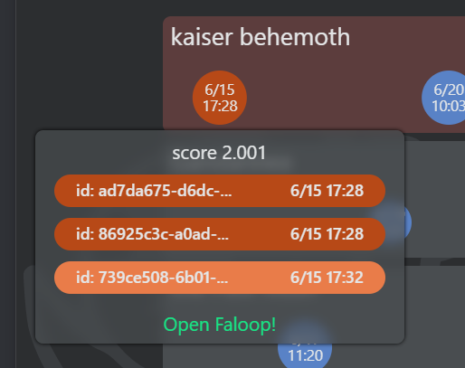
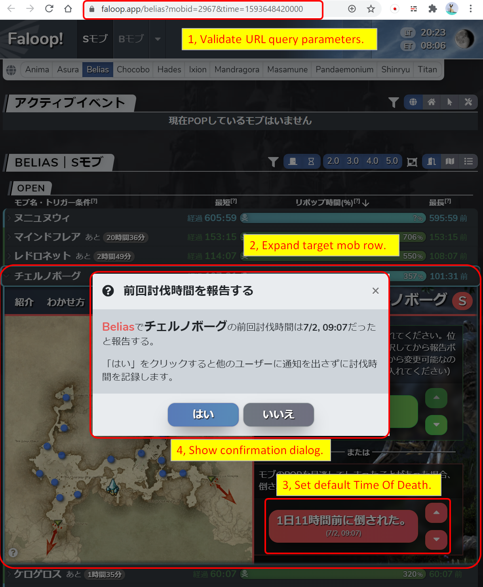

# ffxiv-the-hunt.net -> Faloop! 連携用ユーザースクリプト

## 機能

### ffxiv-the-hunt.net 用ユーザースクリプト

* CSSの上書き

  Faloop!から報告されたレポートを青色で表示します。またuidの文字列を"Faloop!"に置換します。

  

* "Open Faloop!"リンクの追加

  Faloop!から未報告のSモブレポート(フォーギヴンリベリオンを除く)に対して、報告連携用のリンクを追加します。

  

  このリンクをクリックすると、新規のウィンドウに、次のURL形式でFaloop!を開きます。
  
  https://faloop.app/[worldname]?mobid=[mobid]&time=[timeofdeath]
  
  パラメータ | 説明
  ------------ | -------------
  worldname | 表示するワールド名(小文字)
  mobid | 対象のモブID
  timeofdeath | 対象の討伐時刻(UNIXTIME)。hunt.net側の報告の中央値

### Faloop! 用ユーザースクリプト

* 自動的に「レポート」タブを開き、討伐時刻のデフォルト値をセット

  Faloop!がmobidとtimeのURLクエリパラメータを伴って開かれた場合、自動的に「レポート」タブを開き、討伐時刻のデフォルト値をセットします。
  ユーザーは引き続き入力の確認と報告の実行を手動で実施する必要がありますが、手動による入力値のミスを軽減できます。

  

## サンプルムービー

https://lanaklein14.github.io/lanaklein14.github.io/hunt-faloop-integration.mp4

## 導入手順 (PC版Chrome + "User JavaScript and CSS" 拡張機能を使う場合)

1. 前提拡張機能のインストール
   1. [User JavaScript and CSS](https://chrome.google.com/webstore/detail/user-javascript-and-css/nbhcbdghjpllgmfilhnhkllmkecfmpld) 拡張機能をChromeにインストールします。

1. 連携用ユーザースクリプトのインポート
   1. "User JavaScript and CSS" 拡張機能の歯車アイコンをクリックしてトップページを表示します。
   1. "Libraries" タブで、次の2つのjavascriptファイルを追加します。
   
      Name | URL
      ------------ | -------------
      side_huntnet.js | https://lanaklein14.github.io/lanaklein14.github.io/side_huntnet.js
      side_faloop.js | https://lanaklein14.github.io/lanaklein14.github.io/side_faloop.js
      
      

   1. ページを閉じます。

1. ffxiv-the-hunt.net用のルール作成
   1. https://ffxiv-the-hunt.net/ を開きます。
   1. "User JavaScript and CSS" 拡張機能の "+Add new"ボタンをクリックします。
   1. JSペインに"//"と入力してセーブできる状態にします。CSSペインは空で構いません。
   1. Saveボタンの隣にあるボタンをクリックして、"side_huntnet.js"にチェックを付けます。

      

   1. Saveボタンをクリックします。
   1. ページを閉じます。
   
1. Faloop!用のルール作成
   1. https://faloop.app/ を開きます。
   1. "User JavaScript and CSS" 拡張機能の "+Add new"ボタンをクリックします。
   1. JSペインに"//"と入力してセーブできる状態にします。CSSペインは空で構いません。
   1. Saveボタンの隣にあるボタンをクリックして、"side_faloop.js"にチェックを付けます。

      

   1. Saveボタンをクリックします。
   1. ページを閉じます。

## 導入手順 (ios版mobile safari + ショートカットを使う場合)

ショートカットはios13以降から使える標準アプリです。また、導入するにあたっては、デフォルトでは許可されていない「信頼されていないショートカットの許可」を有効にする必要があるので、
趣旨を十分理解したうえでご利用ください。

1. ショートカットのインポート
   1. iOSのデバイスで [HuntFaloopショートカット](https://www.icloud.com/shortcuts/8764865e738b4d0fa6b26025ebf73f19) のリンクをクリックします。
   1. 「Get Shortcut」ボタンをクリックして、ショートカットアプリに「HuntFaloop」を取り込みます。

1. ショートカットを受け入れるように許可設定
   1. 下記サイトを参考に、設定⇒ショートカットで「信頼されていないショートカットの許可」を有効にします。
      一度、連携の実行を失敗させてからでないと選べない可能性があるので注意してください。
      https://usedoor.jp/howto/digital/iphone-ipad/ios-shortcut-security-kyoka/

1. 連携の実行
   1. Safariで https://ffxiv-the-hunt.net/ を開きます。
   1. 共有ボタンをクリックし、一番下に表示される「HuntFaloop」を選択します。初回はアクセス許可を聞かれるので「許可」します。
      面倒ですが、この操作はページをリロードするたびに毎回実行する必要があるようです。(ショートカット機能の仕様)
   1. Open Faloop! リンクから https://faloop.app/ を開きます。
   1. faloopのサイトが表示されたら、こちらでも共有ボタンをクリックし、一番下に表示される「HuntFaloop」を選択します。
      面倒ですが、この操作は。。。以下同文。
   
## 注意事項

* 利用者は、あらかじめFaloop!を「報告者」権限で開けるようにしておく必要があります。
* 討伐時刻の入力可能時刻は、Faloop!側で管理しているモブごとの最新討伐時刻から算出した制限が掛かるため、古い日時のレポートから連携した場合にデフォルト値が上手くセットされない場合があります。
* 討伐時刻の情報は「現在時刻からの差分」で保持しているため、連携で画面を開いた直後は正確な値になりますが、その後放置すると、徐々に時刻がずれていきます。連携して報告を確定する場合は、1分以内を目安に報告完了まで済ませてください。
* hunt.netやFaloop!のバージョンアップによって、スクリプトが突然動かなくなる可能性があります。
