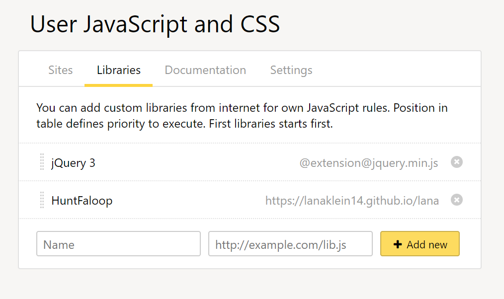
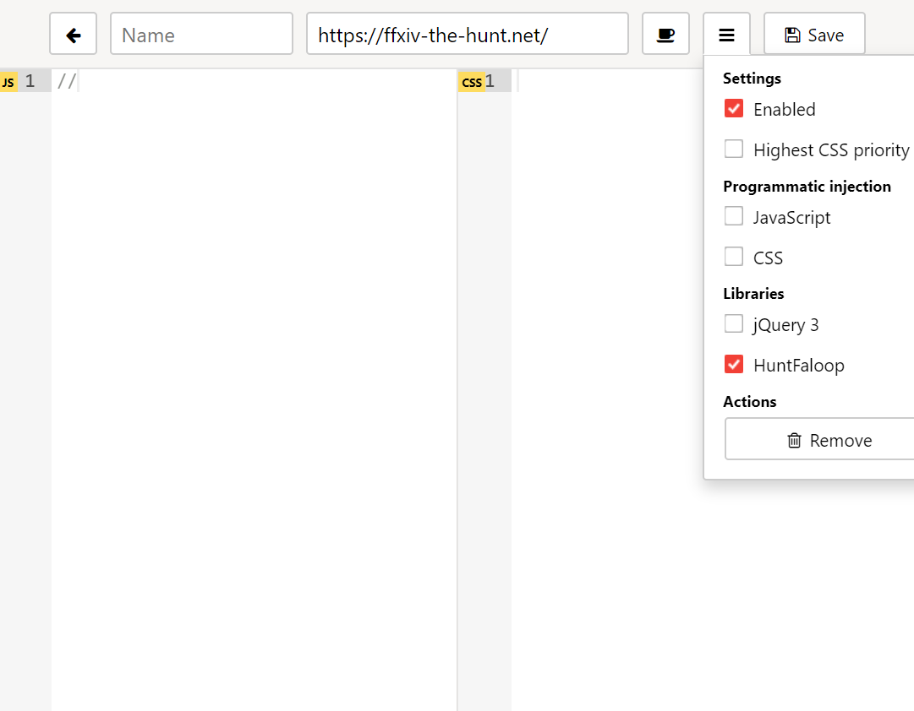
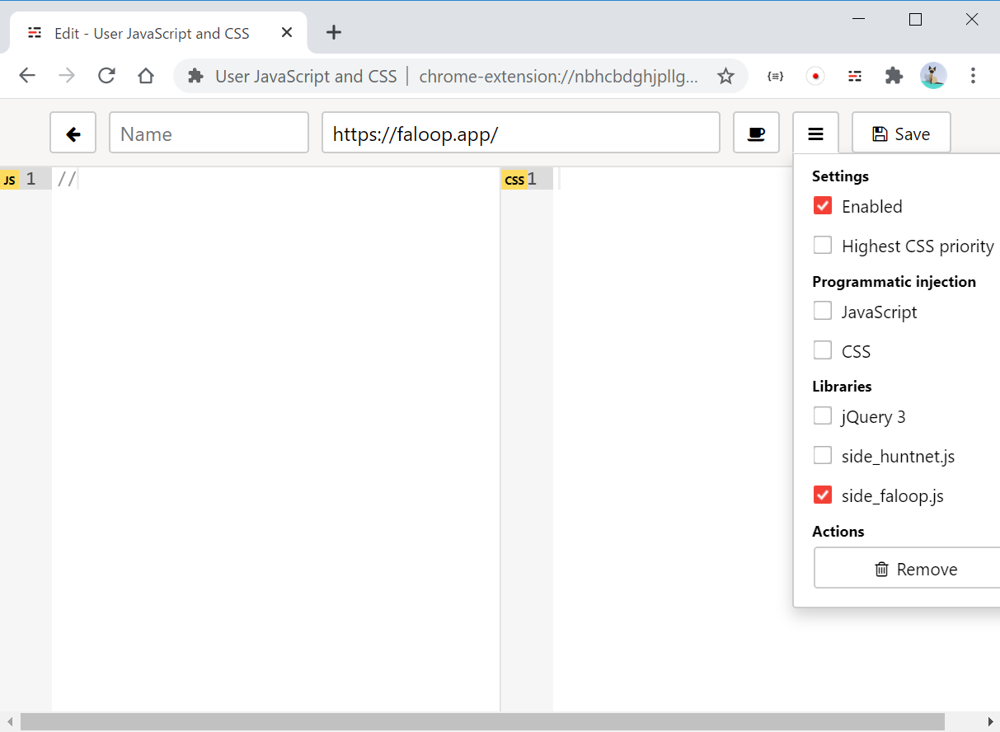

# Custom JavaScripts for ffxiv-the-hunt.net -> Faloop! integration

## Sample movie

https://lanaklein14.github.io/lanaklein14.github.io/hunt-faloop-integration.mp4

## Installation (using "User JavaScript and CSS" extension)

1. Install the prerequisite extension
   1. Install [User JavaScript and CSS](https://chrome.google.com/webstore/detail/user-javascript-and-css/nbhcbdghjpllgmfilhnhkllmkecfmpld) extension to Chrome.

1. Import custom javascripts for integration
   1. Click "User JavaScript and CSS" extension "Gear" icon to open to the Top page.
   1. In "Libraries" tab, add the following 2 javascript files.
   
      Name | URL
      ------------ | -------------
      side_huntnet.js | https://lanaklein14.github.io/lanaklein14.github.io/side_huntnet.js
      side_faloop.js | https://lanaklein14.github.io/lanaklein14.github.io/side_faloop.js
      
      

   1. Close the page.

1. Create rule for ffxiv-the-hunt.net
   1. Navigate to https://ffxiv-the-hunt.net/ 
   1. Click "User JavaScript and CSS" extension "+Add new" button.
   1. Enter "//" in JS pane to enable saving. Leave the CSS pane empty.
   1. Click the hamburger button (next to the save button) and check "side_huntnet.js".

      

   1. Click the save button.
   1. Close the page.
   
1. Create rule for Faloop!
   1. Navigate to https://faloop.app/ 
   1. Click "User JavaScript and CSS" extension "+Add new" button.
   1. Enter "//" in JS pane to enable saving. Leave the CSS pane empty.
   1. Click the hamburger button (next to the save button) and check "side_faloop.js".

      

   1. Click the save button.
   1. Close the page.
