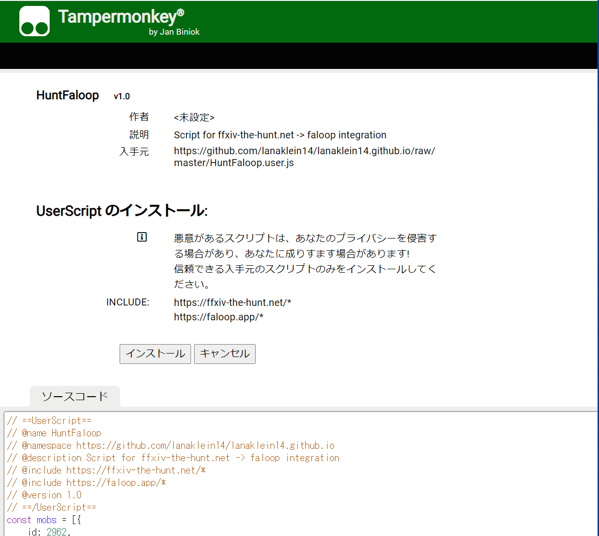
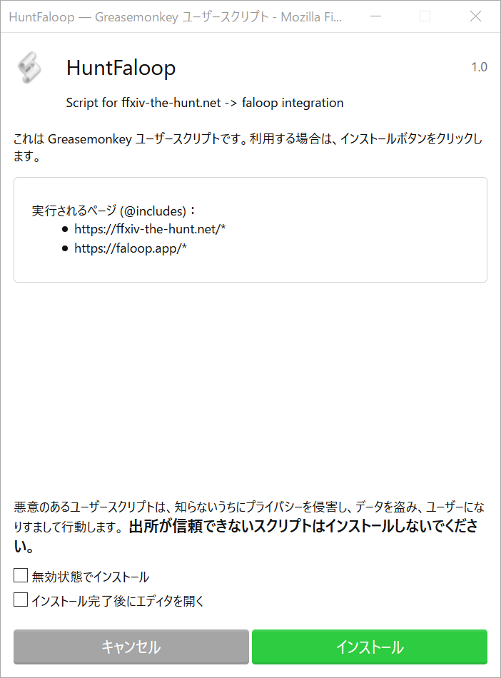

# Custom JavaScripts for ffxiv-the-hunt.net -> Faloop! integration

## Features

### Effects on ffxiv-the-hunt.net

* Overwrite the CSS

  Set blue color to the reports which is reported by Faloop. Also replace the uid string to "Faloop!".

  

* Add "Open Faloop!" link

  Add integration link to the S-mob reports (exclude forgiven rebellion) which is NOT reported by Faloop.

  

  It link and lauches Faloop App in new window with following URL.
  
  https://faloop.app/[worldname]?mobid=[mobid]&time=[timeofdeath]
  
  Parameter | Description
  ------------ | -------------
  worldname | world name in lowercase string
  mobid | mob id in integer
  timeofdeath | time of death in unixtime millisec. median of the candidate reports

### Effects on Faloop!

* Automatically open the "Report" tab, set default Time of Death and show confirmation dialog.

  When Faloop is launched with mobid and time URL query parametes, it tries to open the "Report" tab, set the default Time of Death and show confirmation dialog.
  The user still have to confirm and submit the report manually, but it will reduce the chance or input mistakes.

  

## Sample movie

https://lanaklein14.github.io/lanaklein14.github.io/hunt-faloop-integration.mp4 (deprecated)

## Tested environment

  OS | Browser | Extension/Addon | Comment
  ------------ | ------------- | ------------- | -------------
  PC | Chrome | Tampermonkey | recommend
  PC | Firefox | Greasemonkey or Tampermonkey | recommend
  Android | Firefox | Greasemonkey or Tampermonkey | recommend
  PC | Chrome | User Javascript and CSS | 

## Setup Guide (for PC Chrome with "Tampermonkey" extension)

1. Install the prerequisite extension
   1. Install [Tampermonkey](https://chrome.google.com/webstore/detail/tampermonkey/dhdgffkkebhmkfjojejmpbldmpobfkfo) extension to Chrome.

1. Import custom javascripts for integration
   1. Click [here](https://github.com/lanaklein14/lanaklein14.github.io/raw/master/HuntFaloop.user.js) on Chrome.
   1. Click "Install" in the following confirmation window.

      

## Setup Guide (for PC/Android Firefox with "Greasemonkey" or "Tampermonkey" addon)

1. Install the prerequisite extension
   1. Install either [Greasemonkey](https://addons.mozilla.org/ja/firefox/addon/greasemonkey/) or [Tampermonkey](https://addons.mozilla.org/ja/firefox/addon/tampermonkey/) addon to Firefox.
   
1. Import custom javascripts for integration
   1. Click [here](https://github.com/lanaklein14/lanaklein14.github.io/raw/master/HuntFaloop.user.js) on Firefox.
   1. Click "Install" in the following confirmation window. The screen shot is in case of Greasemonkey.

      

## Setup Guide (for PC Chrome with "User JavaScript and CSS" extension)

1. Install the prerequisite extension
   1. Install [User JavaScript and CSS](https://chrome.google.com/webstore/detail/user-javascript-and-css/nbhcbdghjpllgmfilhnhkllmkecfmpld) extension to Chrome.

1. Import custom javascripts for integration
   1. Click "User JavaScript and CSS" extension "Gear" icon to open to the Top page.
   1. In "Libraries" tab, add the following javascript file.
   
      Name | URL
      ------------ | -------------
      HuntFaloop | https://lanaklein14.github.io/lanaklein14.github.io/HuntFaloop.user.js
      
      

   1. Close the page.

1. Create rule for ffxiv-the-hunt.net
   1. Navigate to https://ffxiv-the-hunt.net/ 
   1. Click "User JavaScript and CSS" extension "+Add new" button.
   1. Enter "//" in JS pane to enable saving. Leave the CSS pane empty.
   1. Click the hamburger button (next to the save button) and check "HuntFaloop".

      

   1. Click the save button.
   1. Close the page.
   
1. Create rule for Faloop!
   1. Navigate to https://faloop.app/ 
   1. Click "User JavaScript and CSS" extension "+Add new" button.
   1. Enter "//" in JS pane to enable saving. Leave the CSS pane empty.
   1. Click the hamburger button (next to the save button) and check "HuntFaloop".

      

   1. Click the save button.
   1. Close the page.

